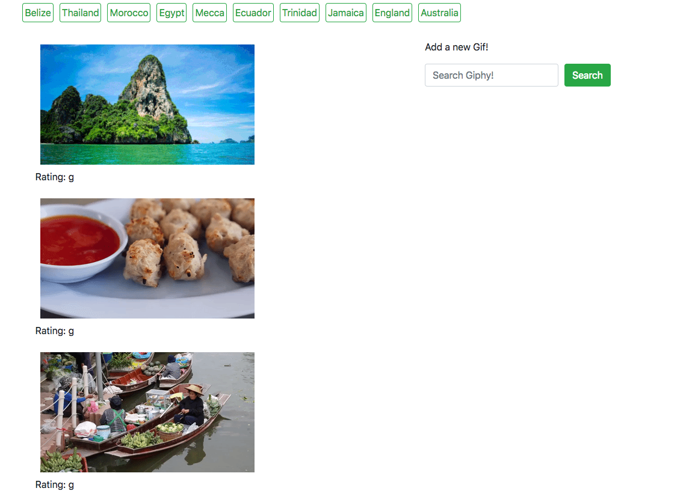

# GifTastic

Search and find any gif from the [Giphy website !](http://giphy.com)

### Wathching the magic happen
Click on a `button` from the nav-bar of the screen and see `rated: G - PG` gif image for each country listed. On first click of the button the images are in the data state `still` but once you click on the image the data state will `animate` and you can enjoy the gif!

### Adding new Gifs!
With the search bar on the side of the web-page you can search the [Giphy](http://giphy.com) library for any gif, wanna see a funny cat gif? `Search` for it in the search bar and enjoy! :wink:

### Link to Webpage

https://kalieshapickering.github.io/GifTastic/